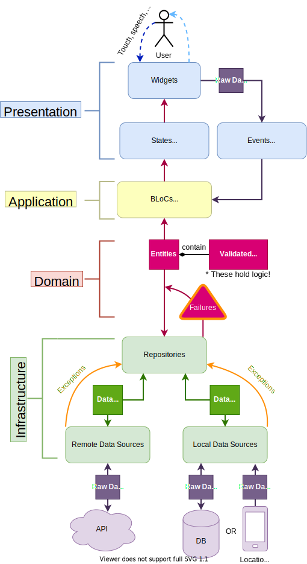

# Domain-Driven Design + Firebase Flutter Course

### The whole accompanying tutorial series is available at :point_right: [this post](https://resocoder.com/flutter-firebase-ddd-course) :point_left:.

#### _Find more tutorials on [resocoder.com](https://resocoder.com)_

 

<h3 align="center">DDD Architecture Proposal</h3>

 

 
 

 
_Be prepared for **real** app development_
